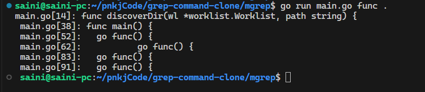

# Grep command
- This project is a clone of the grep command with some additional functionalities.

## How to setup this project
- Clone the repository.
- Run the command "go mod tidy"
- Go to the folder in mgrep.

## Input & Output format
- Input Format will be like this for searching
-     go run main.go keyword_which_you_want_to_search path_where_you_want_to_search

- Output format will be many lines in the format of 
-       filePath[LineNumber] : Line

- Output format : 

Explanation :-
- As you see I am in mgrep path and then I ran `go run main.go func . `   
means I want to search func keyword in current directory.
- You can see the results in the above-mentioned image.